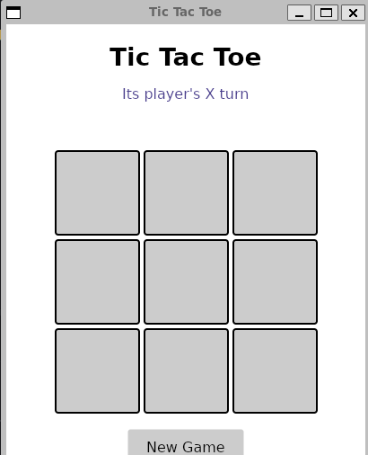

# TicTacToe

A simple Tic-Tac-Toe desktop app built with C# and Avalonia, following the MVVM pattern.

## Features

- Classic 3x3 Tic-Tac-Toe, two players (X and O) on the same machine
- Win detection for rows, columns, and diagonals
- Draw detection
- "New game" button to reset the board

## Tech stack

- **C# / .NET 8**
- **Avalonia UI** — cross-platform UI framework (runs on Windows, Linux, macOS)
- **MVVM** pattern, using **CommunityToolkit.Mvvm** for observable properties and commands

## Project structure

TicTacToe/
- Models/
    - Board.cs — Grid state (3x3 char array) and current player
    - GameManager.cs — Game rules: valid moves, turn handling, win/draw detection
    - GameResult.cs — Enum: InProgress, PlayerXWins, PlayerOWins, Draw
- ViewModels/
    - MainViewModel.cs — Main game state exposed to the UI, handles clicks
    - CellViewModel.cs — A single board cell (position + symbol + click command)
- Views/
    - MainWindow.axaml — The window UI (board grid, status messages, reset button)
- Program.cs — App entry point

## Prerequisites

- [.NET 8 SDK](https://dotnet.microsoft.com/download) installed

## Run it

    git clone https://github.com/martinvtt/TicTacToe.git
    cd TicTacToe
    dotnet restore
    dotnet run

A window should open with the game board.

## How to play

Click a cell to place your mark. Players alternate turns starting with X. The game announces a winner as soon as three marks are aligned, or a draw if the board fills up with no winner. Click "Nouvelle partie" to start over.

## Here's an image of the final result:

